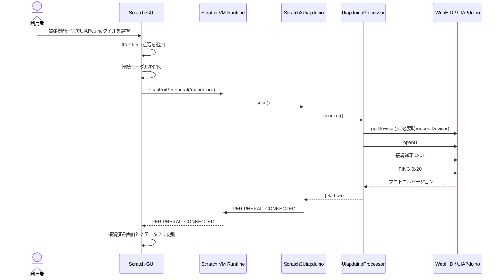

# Scratchのステータスボタンを使ったWebHID周辺機器接続フロー 実装仕様書

## 1. 文書情報

| 項目 | 内容 |
|---|---|
| 対象製品 | Scratch UIAPduino（Scratch Desktop 3.29系を基にした現行版） |
| 対象拡張ID | `uiapduino` |
| 対象通信方式 | WebHID |
| 対象外 | Xcratch外部拡張機能、Webサイト単体版、ファームウェアのプロトコル変更 |
| 基準日 | 2026-08-06 |
| 文書の目的 | 拡張追加時の自動接続モーダルとブロックパレットのステータスボタンから、UIAPduinoを検索・接続・切断できるようにする実装方針を定義する |

## 2. 目的

拡張機能一覧でUIAPduinoのタイルを選択したとき、Scratch標準の接続モーダルを自動的に開き、WebHIDでUIAPduinoの検索と接続を開始する。

加えて、UIAPduino拡張のカテゴリ見出しにScratch標準のステータスボタンを表示する。初回接続をキャンセルした場合、接続が切れた場合、または後から接続する場合は、未接続時の「!」から接続モーダルを再度開けるようにする。接続後はステータスボタンを接続済み表示へ更新し、接続済みのボタンからは接続状態の確認と切断を行えるようにする。

現在の「UIAPduino につなぐ」ブロックと既存プロジェクトは維持する。拡張追加時の自動接続モーダルとステータスボタンは接続経路を追加するものであり、既存opcodeや通信プロトコルを置き換えるものではない。

## 3. 用語

| 用語 | 本書での意味 |
|---|---|
| ステータスボタン | ブロックカテゴリ見出しに表示される接続状態ボタン。未接続時は「!」が表示される |
| 周辺機器接続フロー | ステータスボタン、接続モーダル、Scratch VMのPeripheral Extension APIを連携させる一連の処理 |
| `scan()` | Scratch GUIが接続開始時にPeripheral Extension API経由で呼ぶ拡張メソッド |
| processor | `uiapduinoProcessor.js`のWebHID通信クラス |
| transport open | `HIDDevice.open()`が成功し、ハンドシェイク用通信だけが可能な内部状態 |
| ready | transport openに加えてPINGによるプロトコル照合まで成功し、通常ブロックを実行できる状態 |
| 論理接続 | 本仕様ではready状態と同義。外部公開の`isConnected()`が`true`になる状態 |

## 4. 実装前の状態

本章は変更前の姿を記録したものであり、実装完了後の現状ではない。実装後のコードは7章と8章の定義に従う。

### 4.1 構成

現行リポジトリは、固定バージョンのScratch VM、Scratch GUI、Scratch Desktopへ必要ファイルを重ねるオーバーレイ方式である。

| ファイル | 現在の役割 |
|---|---|
| `scratch-vm/src/extension-support/extension-manager.js` | `uiapduino`を組み込み拡張として登録する |
| `scratch-vm/src/extensions/scratch3_uiapduino/index.js` | `getInfo()`、ブロック定義、processorへの処理委譲を行う |
| `scratch-vm/src/extensions/scratch3_uiapduino/uiapduinoProcessor.js` | WebHIDデバイスの取得、open、通信、切断、コマンドキューを管理する |
| `scratch-gui/src/lib/libraries/extensions/index.jsx` | 拡張機能ライブラリにUIAPduinoの表示情報を登録する |
| `scratch-gui/src/lib/libraries/extensions/uiapduino/*` | 拡張一覧とブロックカテゴリ用画像を保持する |
| `scratch-desktop/src/main/index.js` | ElectronのWebHID許可、VID/PID制限、HIDデバイス自動選択を設定する |
| `build-scratch3-uiapduino.ps1` | Scratch 3.29系を取得し、このリポジトリを重ねてDesktopアプリをビルドする |

### 4.2 現在の接続処理

`Scratch3Uiapduino.connect()`は`UiapduinoProcessor.connect()`を呼ぶ。processorは次の順序で処理する。

1. `navigator.hid.getDevices()`から許可済みデバイスを取得する。
2. VID `0x1209`、PID `0xD004`で候補を絞る。
3. Usage Page `0xFF00`、Usage `0x01`のコレクションを持つ候補を優先する。
4. 候補がなければ`navigator.hid.requestDevice()`を呼ぶ。
5. `HIDDevice.open()`を呼ぶ。
6. `inputreport`と物理切断イベントを登録する。
7. 接続通知`0x01`を送る。
8. PING `0x20`でプロトコルバージョン1を照合する。
9. 全処理に成功した場合だけ`true`を返す。

現状では次の処理が不足している。

- `getInfo()`に`showStatusButton`がない。
- 拡張インスタンスが`runtime.registerPeripheralExtension()`へ登録されていない。
- Peripheral Extension APIが呼ぶ`scan()`がない。
- 拡張クラスの`disconnect()`がない。
- 接続・切断時にScratch VMの周辺機器イベントを通知していない。
- Scratch GUIのUIAPduino定義に`launchPeripheralConnectionFlow`がなく、拡張追加時に接続モーダルが自動起動しない。
- Scratch GUIのUIAPduino定義に接続モーダル用画像とメッセージがない。

## 5. Scratch 3.0側に既に存在する仕組み

ビルドスクリプトが固定しているScratch VM `0.2.0-prerelease.20220222132735`とScratch GUI `scratch-desktop-v3.29.0`には、以下の仕組みが存在する。

1. VMは`getInfo().showStatusButton`をカテゴリ情報へコピーし、toolbox XMLへ`showStatusButton="true"`を出力する。
2. GUIはextension dataの`launchPeripheralConnectionFlow`を参照し、`true`の拡張カテゴリが選択されたとき接続モーダルを開く。
3. GUIはステータスボタンのクリックも接続モーダル開始処理へ渡す。
4. 接続モーダルのScanning Stepは`vm.scanForPeripheral(extensionId)`を呼ぶ。
5. VMは登録済み周辺機器拡張の`scan()`を呼ぶ。
6. 一覧から機器を選ぶ標準経路では、`vm.connectPeripheral(extensionId, peripheralId)`が拡張の`connect(peripheralId)`を呼ぶ。UIAPduinoの一覧なしフローではこの経路を通常使用しない。
7. GUIは`PERIPHERAL_CONNECTED`と`PERIPHERAL_DISCONNECTED`を受けてステータスボタンを再描画する。
8. GUIは`vm.getPeripheralIsConnected(extensionId)`の結果で未接続／接続済み表示を決める。

したがってScratch本体へ新しい接続UIやVM APIを追加する必要はない。UIAPduino拡張を既存APIへ接続することが実装の中心となる。

## 6. 実装後の動作

### 6.1 拡張追加時の初回接続



`scan()`は`PERIPHERAL_LIST_UPDATE`を送らず、デバイス一覧も生成しない。Scanning Stepは「デバイスを検索中」のまま待機し、接続成功時の`PERIPHERAL_CONNECTED`で直接接続済み画面へ遷移する。接続に失敗した場合は`PERIPHERAL_SCAN_TIMEOUT`で「デバイスが見つかりません」へ遷移する。単一接続を前提とするため、一覧に1台表示して利用者にもう一度選ばせる操作は採用しない。

Scratch DesktopのElectron mainプロセスはUIAPduinoだけを許可し、`requestDevice()`時には該当デバイスを自動選択する。そのため、ブラウザー標準のデバイス選択画面が表示されない場合がある。これは現行Desktop実装の仕様であり、接続モーダルが開かないという意味ではない。

### 6.2 ステータスボタンからの接続・再接続

初回接続をキャンセルした場合や物理切断後は、UIAPduinoカテゴリの未接続ステータス「!」をクリックすると同じ接続モーダルが開き、`scanForPeripheral("uiapduino")`から検索を再開する。

すでに接続済みの場合は、ステータスボタンから接続済み画面を開き、現在の接続を確認または切断できる。拡張追加時とステータスボタン操作時は同じ`scan()`、接続判定、イベント通知を使用する。

### 6.3 意図的な切断

1. 接続済み状態でステータスボタンをクリックする。
2. 接続モーダルが接続済み画面を表示する。
3. 利用者が「切断」を押す。
4. GUIが`vm.disconnectPeripheral("uiapduino")`を呼ぶ。
5. VMが拡張クラスの`disconnect()`を呼ぶ。
6. 拡張クラスが`processor.disconnect()`を完了させる。
7. 拡張クラスが`PERIPHERAL_DISCONNECTED`をemitする。
8. GUIがステータスボタンを未接続表示へ戻す。

### 6.4 USBケーブルが抜かれた場合

1. processorが`navigator.hid`の`disconnect`イベントを受ける。
2. 対象が現在接続中の`HIDDevice`と一致する場合だけ、デバイス参照、ready状態、コマンドキューを破棄する。
3. processorから拡張クラスへ物理切断を通知する。
4. 拡張クラスが`PERIPHERAL_DISCONNECTED`をemitし、ステータスボタンを未接続表示へ戻す。
5. 続けて`PERIPHERAL_CONNECTION_LOST_ERROR`をemitし、利用者へ接続喪失を通知する。

接続喪失イベントのpayloadはScratchの既存周辺機器実装に合わせ、次の形とする。

```js
{
    message: 'Scratch lost connection to',
    extensionId: EXTENSION_ID
}
```

`PERIPHERAL_CONNECTION_LOST_ERROR`だけではステータスボタンが更新されないため、`PERIPHERAL_DISCONNECTED`も必ず送る。モーダルの「切断」から意図的に切断した場合は接続喪失エラーを送らない。

自動再接続は行わない。再接続は利用者が再度ステータスボタンまたは既存の接続ブロックから開始する。

## 7. 詳細設計

### 7.1 拡張ID、opcode、実装メソッド

以下は変更しない。

- 拡張ID: `uiapduino`
- 既存opcode: `connect`、`isConnected`、`pinMode`、`digitalWrite`、`digitalRead`、`analogWrite`、`analogRead`、`clearQueue`
- ブロック引数、メニュー値、プロジェクト保存形式

opcode `connect`とPeripheral Extension APIの`connect(peripheralId)`は同名になるため、同じJavaScriptメソッドを兼用しない。Scratch VMがサポートするblock metadataの`func`を使用し、ブロック実装を`connectBlock()`へ分離する。

```js
{
    opcode: 'connect',
    func: 'connectBlock',
    text: this._getText('connect'),
    blockType: BlockType.BOOLEAN
}
```

役割を次のように定義する。

| メソッド | 呼び出し元 | 役割 |
|---|---|---|
| `connectBlock()` | opcode `connect`のブロック | 既存ブロック互換の`Promise<boolean>`を返す |
| `scan()` | Peripheral Extension API | 一覧を作らず、WebHID接続を直接開始する |
| `connect(peripheralId)` | Peripheral Extension API | API契約として実装する。現行の一覧なしフローでは通常呼ばれず、`peripheralId`は使用しない |
| `disconnect()` | Peripheral Extension API | 意図的に接続を切断する |
| `isConnected()` | ブロックおよびPeripheral Extension API | ハンドシェイク完了済みかを同期booleanで返す |

`scan`、Peripheral APIの`connect`、`disconnect`はブロックopcodeには追加しない。

`isConnected`もopcodeとPeripheral Extension APIで同名になるが、こちらは引数も戻り値も一致するため、意図的に同じメソッドを共用する。分離する必要はない。

### 7.2 `Scratch3Uiapduino`の初期化

`scratch-vm/src/extensions/scratch3_uiapduino/index.js`へ拡張ID定数を定義し、`getInfo()`、Peripheral Extension API登録、イベント通知で同じ値を使用する。

概念上の構成は次のとおりとする。

```js
const EXTENSION_ID = 'uiapduino';

constructor (runtime) {
    this.runtime = runtime;
    this.processor = new UiapduinoProcessor();
    this.runtime.registerPeripheralExtension(EXTENSION_ID, this);
}
```

processorの物理切断通知もここで受け取る。ただし、意図的な切断と物理切断で`PERIPHERAL_DISCONNECTED`を二重送信しないこと。

### 7.3 `getInfo()`

返却オブジェクトへ`showStatusButton`を追加し、既存connectブロックへ`func`を指定する。

```js
showStatusButton: true,
blocks: [
    {
        opcode: 'connect',
        func: 'connectBlock',
        text: this._getText('connect'),
        blockType: BlockType.BOOLEAN
    }
]
```

`showStatusButton`はカテゴリ見出しにステータスボタンを表示するための指定である。opcodeは`connect`のままなので、既存プロジェクトの保存形式は変わらない。

### 7.4 `scan()`

拡張クラスへ`scan()`を追加する。`scan()`は`PERIPHERAL_LIST_UPDATE`を送らず、WebHIDデバイスの取得、open、接続通知、PING照合まで直接実行する。

要求事項は次のとおり。

- 接続済みの場合は新しい接続処理を開始しない。ただし`PERIPHERAL_CONNECTED`は再通知する。通知しないと接続モーダルが検索中のまま止まるためである。現行GUIは接続済みなら接続済み画面から開くのでこの経路には通常入らないが、安全弁として実装する。
- 接続処理中に再度呼ばれた場合は、同じ接続中Promiseを返して二重openを防ぐ。
- processorが`{ok: true}`を返した時点でのみ`PERIPHERAL_CONNECTED`をemitする。
- 成功するまでデバイス一覧は空のままとし、成功イベントで接続済み画面へ直接遷移する。
- processorが`{ok: false, reason, error?}`を返した場合は後始末を確認し、理由にかかわらず`PERIPHERAL_SCAN_TIMEOUT`をemitする。
- `PERIPHERAL_REQUEST_ERROR`は現行GUIでScratch Link／Bluetooth向けの誤案内を表示するため使用しない。

概念上の処理は次のとおりとする。

```js
scan () {
    return this._connectAndNotify({fromScan: true});
}
```

`_connectAndNotify()`は`scan()`、`connect(peripheralId)`、`connectBlock()`から共用し、接続成功時のScratch VM通知を一箇所へ集約する。`PERIPHERAL_SCAN_TIMEOUT`は`fromScan: true`の場合だけ通知する。

`PERIPHERAL_CONNECTED`の送信条件は「まだ接続を通知していない」または「`scan()`から呼ばれた」とする。前者だけではブロックからの再接続で重複通知が出て、後者を入れないと接続済み状態の`scan()`でモーダルが止まる。

### 7.5 `connectBlock()`とPeripheral APIの`connect()`

既存プロジェクトとの互換性のため、ブロックopcode `connect`は削除も変更もしない。block metadataの`func: 'connectBlock'`により、JavaScript実装だけをPeripheral APIから分離する。

```js
connectBlock () {
    return this._connectAndNotify({fromScan: false})
        .then(result => result.ok);
}

connect (peripheralId) {
    return this._connectAndNotify({fromScan: false});
}
```

`connect(peripheralId)`はScratch VMのPeripheral Extension API用である。本仕様では一覧を出さないため通常は呼ばれないが、登録APIの契約を明確にするため実装する。現時点では`peripheralId`を無視する。

既に接続済みの場合、`connectBlock()`は`true`を返す。状態遷移がない場合、`PERIPHERAL_CONNECTED`を重複通知しない。ブロック経由の失敗は`false`を返し、接続モーダル用イベントは送らない。

### 7.6 `disconnect()`

拡張クラスへPeripheral Extension API用の`disconnect()`を追加する。

- `processor.disconnect()`を呼び、HIDDeviceをcloseする。
- 実行待ちキューと応答待ちコマンドは既存`_teardown()`で破棄する。
- 接続状態から未接続状態へ変わった場合に`PERIPHERAL_DISCONNECTED`をemitする。
- 利用者による意図的な切断では`PERIPHERAL_CONNECTION_LOST_ERROR`をemitしない。
- 未接続時に呼ばれても例外にしない。
- 切断完了を表すPromiseを返してよい。ただしScratch VM 3.29の`disconnectPeripheral()`はそのPromiseを待たないため、例外は拡張内で処理する。

### 7.7 `isConnected()`と内部接続状態

Scratch GUIが呼ぶ`isConnected()`と、ハンドシェイク中の通信可否を分離する。

processorへ`ready`状態を追加し、次の2段階で判定する。

```js
isTransportOpen () {
    return Boolean(this.device && this.device.opened);
}

isConnected () {
    return this.ready && this.isTransportOpen();
}
```

状態遷移は次のとおりとする。

1. 接続開始時に`ready = false`とする。
2. `HIDDevice.open()`後はtransportだけが利用可能となる。
3. 接続通知を送り、内部ハンドシェイク用リクエストでPINGを実行する。
4. プロトコルバージョンが一致した場合だけ`ready = true`とする。
5. 接続失敗、意図的切断、物理切断では`ready = false`へ戻す。

通常ブロックが使用する`request()`は`ready === true`を要求する。PINGは接続確立前に必要なので、transport openだけを条件とするprivateな内部リクエスト経路を使用する。通常の`request()`のゲートを一時的に緩めてPINGを通す設計にはしない。

外部公開の`isConnected()`と「つながっている」ブロックは、単なるHID openではなく「ハンドシェイクが完了し、UIAPduinoとして通信可能」を意味する。Scratch GUIはこの値を同期的に読むため、必ずbooleanを同期的に返す。

### 7.8 processorの責務と接続結果

`uiapduinoProcessor.js`は引き続きWebHIDとUIAPduinoプロトコルだけを担当し、Scratch GUIやScratch Runtimeを直接参照しない。

追加する責務は次のとおり。

- 同時接続処理を一本化するための接続中Promiseまたは同等のガード
- transport open状態とハンドシェイク完了済み`ready`状態の分離
- ハンドシェイク専用の内部リクエスト経路
- 物理切断を上位へ通知するコールバック
- 接続失敗理由の分類
- 接続失敗時の確実な後始末

`connect()`はbooleanではなく、次の構造化結果を返す。

```js
{ok: true}
```

失敗時は次の形とする。

```js
{
    ok: false,
    reason: 'not-found-or-cancelled',
    error: optionalError
}
```

`reason`は最低限、次を定義する。

| reason | 意味 |
|---|---|
| `no-api` | `navigator.hid`が利用できない |
| `not-found-or-cancelled` | 対象デバイスがない、またはデバイス選択がキャンセルされた |
| `open-failed` | `HIDDevice.open()`に失敗した |
| `handshake-no-response` | PING応答がない |
| `protocol-mismatch` | プロトコルバージョンが一致しない |
| `unknown` | 上記以外の予期しない失敗 |

WebHIDとElectronの現在の戻り方では「対象デバイスなし」と「選択キャンセル」を確実に区別できないため、`not-found-or-cancelled`へ統合する。`error`は原因となった例外がある場合だけ保持し、開発者コンソールの診断に使用する。

`navigator.hid.requestDevice()`はユーザ操作が無い場合に例外を投げる。この失敗も利用者から見れば「デバイスを選べなかった」であるため、`not-found-or-cancelled`に例外を添えて返す。ただしScratch Desktopでは`setDevicePermissionHandler`が`true`を返すため`getDevices()`だけで取得でき、この経路は通常踏まない。

理由コードは`REASON`としてprocessorからexportし、上位が文字列リテラルを重複定義しないようにする。

Scratch Runtimeイベントのemitと、構造化結果からブロック用booleanへの変換は`index.js`側で行う。

### 7.9 接続エラーとGUI通知

processorは理由を区別して返すが、現行Scratch GUI 3.29を変更しない初期実装では、ステータスボタンまたは拡張追加時の`scan()`が失敗した場合、すべて`PERIPHERAL_SCAN_TIMEOUT`へ対応付ける。

| 条件 | processor result | 状態 | `scan()`時のGUI通知 |
|---|---|---|---|
| `navigator.hid`が存在しない | `{ok: false, reason: 'no-api'}` | 未接続 | `PERIPHERAL_SCAN_TIMEOUT` |
| 対象デバイスなし／選択キャンセル | `{ok: false, reason: 'not-found-or-cancelled'}` | 未接続 | `PERIPHERAL_SCAN_TIMEOUT` |
| `open()`失敗 | `{ok: false, reason: 'open-failed'}` | 未接続へ後始末 | `PERIPHERAL_SCAN_TIMEOUT` |
| PING応答なし | `{ok: false, reason: 'handshake-no-response'}` | 未接続へ後始末 | `PERIPHERAL_SCAN_TIMEOUT` |
| プロトコル不一致 | `{ok: false, reason: 'protocol-mismatch'}` | 未接続へ後始末 | `PERIPHERAL_SCAN_TIMEOUT` |
| その他 | `{ok: false, reason: 'unknown'}` | 未接続へ後始末 | `PERIPHERAL_SCAN_TIMEOUT` |
| 接続後の物理切断 | 該当なし | 未接続 | `PERIPHERAL_DISCONNECTED`と`PERIPHERAL_CONNECTION_LOST_ERROR` |

`PERIPHERAL_REQUEST_ERROR`を検索中に送ると、Scratch GUI 3.29の接続モーダルは「Scratch Linkを起動する」「Bluetoothを有効にする」というWebHIDには不適切な画面を表示する。そのため初期実装では使用しない。

モーダルには「デバイスが見つかりません」が表示され、具体的な失敗理由は開発者コンソールへ出力する。UIAPduino固有のエラー文をモーダルへ表示する場合は、Scratch GUI接続モーダルの追加改修として別仕様にする。

`connectBlock()`またはPeripheral APIの`connect(peripheralId)`から失敗した場合は`PERIPHERAL_SCAN_TIMEOUT`を送らない。`connectBlock()`は`false`を返し、詳細理由はログへ残す。

### 7.10 Scratch GUIの拡張情報

`scratch-gui/src/lib/libraries/extensions/index.jsx`のUIAPduino項目へ次を追加する。

| プロパティ | 確定値／方針 |
|---|---|
| `launchPeripheralConnectionFlow` | `true`。拡張追加直後に接続モーダルを開く |
| `useAutoScan` | `false`。通常のScanning Stepから直ちに`scan()`を呼ぶ |
| `connectionIconURL` | 接続モーダル専用の`uiapduino-illustration.png`（266×165） |
| `connectionSmallIconURL` | 既存の`uiapduinoInsetIconURL`を再利用する |
| `connectionBadgeIconURL` | 本仕様で追加するプロパティ。`usb-hid-white.svg`を指定する |
| `connectingMessage` | `FormattedMessage`で英語の既定文言を定義する |
| `helpLink` | `https://github.com/tarosay/scratch3-uiapduino#readme` |

`launchPeripheralConnectionFlow: true`は、micro:bitなどのScratch標準ハードウェア拡張と同様に、拡張追加直後の接続を案内するために使用する。利用者がモーダルをキャンセルしてもUIAPduino拡張自体は追加済みのままとし、後からステータスボタンで接続できる。

`useAutoScan: false`は「検索を開始しない」という意味ではない。通常のScanning Stepがマウントされた時点で`scan()`は自動的に呼ばれる。Bluetooth機器向けの「機器のボタンを押してください」というAuto Scanning画面は使用しない。

接続モーダルの画像には専用ファイルを用意する。当初は一覧用の`uiapduino.png`を再利用する方針だったが、実画面で問題が出たため変更した。

上流の`connection-modal.css`は`.peripheral-activity-icon`の`width`と`height`をコメントアウトしており、画像は原寸で表示される。置き場所の`.activityArea`は高さ165px、モーダル幅は480pxであるため、一覧用の600×372を渡すと枠を上下左右にはみ出し、「接続しました」の文言、ドット、ボタンの上に重なる。透過画像では下の要素が透けて見えるだけだったが、不透明画像に変えた時点で完全に隠れた。はみ出し自体は透過の有無にかかわらず起きている。

上流の画像はmicro:bitが116×95、EV3が92×128、WeDo 2.0が108×48であり、あらかじめ枠に収まる大きさで用意する前提の作りである。したがってCSSへパッチを当てるのではなく、収まる画像を追加する。

| 項目 | 値 |
|---|---|
| ファイル | `scratch-gui/src/lib/libraries/extensions/uiapduino/uiapduino-illustration.png` |
| 寸法 | 266×165 |
| 由来 | `uiapduino.png`（600×372）を高さ165pxへ等比縮小したもの |

**高さは`.activityArea`と同じ165pxちょうどとする。** 内側の余白を引いた149pxで作ると、上下に8pxずつ背景色の帯が出る。実測でも上8px、下8pxであった。165pxで作ると余白の分を覆って帯が消える。`.activityArea`は`overflow`を指定しておらず、flexの中央寄せで上下へ均等にはみ出すため、ちょうど枠いっぱいに収まる。

全幅（480×165）にすると左右の帯も消えるが、次の2点から採用しない。

- 元絵の縦を44%切り落とすことになり、キーボードと基板の一部が欠ける
- バッジは`left: -15px`で絵の左外に出るため、絵がモーダル幅いっぱいになると`.modal-content`の`overflow: hidden`で見切れる

左右には背景色の帯が残るが、上流の各拡張機能も同じ見え方である。

#### 通信方式を表すバッジ

接続中と接続済みの画面には、機器の絵の右上に小さなバッジが重なる。上流の`connecting-step.jsx`と`connected-step.jsx`は`bluetooth-white.svg`を無条件に描画しており、拡張機能ごとに切り替える仕組みがない。UIAPduinoはWebHIDで接続するため、Bluetoothマークは事実と異なる。

バッジを差し替えられるようにする。対象は次のとおり。

| ファイル | 変更内容 |
|---|---|
| `scratch-gui/src/containers/connection-modal.jsx` | extension dataの`connectionBadgeIconURL`を下へ渡す |
| `scratch-gui/src/components/connection-modal/connected-step.jsx` | `props.connectionBadgeIconURL \|\| bluetoothIcon` |
| `scratch-gui/src/components/connection-modal/connecting-step.jsx` | 同上 |
| `scratch-gui/src/lib/libraries/extensions/uiapduino/usb-hid-white.svg` | 新規。20×20の白いUSBマーク |

`components/connection-modal/connection-modal.jsx`は`{...props}`で子へ展開しているため変更しない。

**CSSでバッジを一律に消す方法は採らない。** `.bluetooth-connected-icon`と`.bluetooth-connecting-icon`を`display: none`にすれば1ファイルで済むが、micro:bit、EV3、WeDo 2.0、Go Directのモーダルからもマークが消える。それらはScratch Linkを使う正真正銘のBluetooth機器であり、利用者の表示を壊す。プロパティを持たない拡張機能は上流どおりBluetoothマークのままとする。

バッジの絵は`bluetooth-white.svg`に合わせ、20×20、白1色とする。`.bluetooth-connected-icon`はpadding 5pxの円の中に置かれるため、この寸法から外れると収まらない。文字を含む図案は20pxでは判読できないため使用しない。

### 7.11 接続モーダルとカードの翻訳

ブロック翻訳方式は変更しない。ブロックパレットの文字列は引き続き`scratch-vm`側の`index.js`が`ja`、`ja-Hira`、`en`を自前で持つ。

Scratch GUI側の文言はGUIの既存方式に合わせ、`FormattedMessage`で定義する。

```jsx
<FormattedMessage
    defaultMessage="Connecting to UIAPduino"
    description="Message shown while connecting to UIAPduino."
    id="gui.extension.uiapduino.connectingMessage"
/>
```

`defaultMessage`は英語のままとする。日本語を書くと英語UIを含む全未翻訳ロケールで日本語が表示されるためである。

`gui.*`の訳文は上流の`scratch-l10n`パッケージの`locales/editor-msgs.js`から供給される。同ファイルはTransifexから生成される別リポジトリの成果物で、`npm install`のたびに上書きされるため、`gui.extension.uiapduino.*`を直接書き足すことはできない。実際に固定版を確認したところ、日本語は758件あるが`gui.extension.uiapduino.*`は0件である。既存の`gui.extension.uiapduino.name`と`.description`も本対応より前から英語で表示されていた。

そこで訳文をこのリポジトリ側に持ち、上流のメッセージへ重ねる。

| ファイル | 役割 |
|---|---|
| `scratch-gui/src/lib/libraries/extensions/uiapduino/messages.js` | ロケール別の訳文。新規ファイル |
| `scratch-gui/src/reducers/locales.js` | `editor-msgs`へ上記を重ねる。上流ファイルへのパッチ |

`locales.js`は`editorMessages`をそのまま`messagesByLocale`に入れているので、ロケールごとに`Object.assign`で重ねたものへ差し替える。`UPDATE_LOCALES`で外からメッセージを差し替えられた場合も重ね直す。同じIDがあればこのリポジトリ側が勝つ。将来`scratch-l10n`に訳文が入ってそちらを使う場合は、`messages.js`から該当ロケールを削除する。

対象は次の3件とし、`ja`と`ja-Hira`を用意する。ここに無いロケールは`defaultMessage`の英語が出る。

| ID | ja | ja-Hira |
|---|---|---|
| `gui.extension.uiapduino.name` | UIAPduino | UIAPduino |
| `gui.extension.uiapduino.description` | 自分だけのコントローラーを作ってみよう。 | じぶんだけのコントローラーをつくってみよう。 |
| `gui.extension.uiapduino.connectingMessage` | UIAPduinoに接続中 | UIAPduinoにせつぞくちゅう |

物理切断時の警告文は`gui.alerts.lostPeripheralConnection`であり、上流に訳文があるためこの対応なしで日本語表示になる。

### 7.12 Electron WebHID設定

`scratch-desktop/src/main/index.js`の現行設定を維持する。

- `setDevicePermissionHandler`はHIDかつVID `0x1209`／PID `0xD004`だけを許可する。
- `select-hid-device`は候補からUIAPduinoを選択する。
- `setPermissionCheckHandler`はmain frameのWebHIDだけを許可する。
- about／privacyウィンドウを含む共有sessionへのイベント重複登録を`WeakSet`で防ぐ。

ステータスボタン対応だけを理由に、このファイルへ新しいIPCや独自ダイアログを追加しない。

複数台のUIAPduinoを接続した場合、現行コードは最初の1台を自動選択する。本仕様でも単一接続を前提とし、複数台選択UIは対象外とする。

## 8. 変更対象ファイル

### 8.1 必須変更

| ファイル | 変更内容 |
|---|---|
| `scratch-vm/src/extensions/scratch3_uiapduino/index.js` | 拡張ID定数、Peripheral API登録、`showStatusButton`、`func: 'connectBlock'`、`scan()`、Peripheral APIの`connect()`、`disconnect()`、接続・切断・接続喪失イベント通知を追加 |
| `scratch-vm/src/extensions/scratch3_uiapduino/uiapduinoProcessor.js` | 接続競合防止、transport／ready分離、ハンドシェイク用内部リクエスト、構造化接続結果、物理切断通知、失敗時後始末を追加 |
| `scratch-gui/src/lib/libraries/extensions/index.jsx` | 自動接続モーダル、既存画像の再利用、英語接続メッセージ、確定したhelpLinkを追加 |
| `scratch-gui/src/lib/libraries/extensions/uiapduino/messages.js` | 新規。`ja`と`ja-Hira`の訳文を持つ |
| `scratch-gui/src/reducers/locales.js` | 上流ファイルへのパッチ。`scratch-l10n`のメッセージへ上記を重ねる |
| `scratch-gui/src/lib/libraries/extensions/uiapduino/uiapduino-illustration.png` | 新規。接続モーダル用の266×165画像 |
| `scratch-gui/src/lib/libraries/extensions/uiapduino/usb-hid-white.svg` | 新規。接続バッジ用の20×20 USBマーク |
| `scratch-gui/src/containers/connection-modal.jsx` | 上流ファイルへのパッチ。`connectionBadgeIconURL`を下へ渡す |
| `scratch-gui/src/components/connection-modal/connected-step.jsx` | 上流ファイルへのパッチ。バッジの絵を差し替え可能にする |
| `scratch-gui/src/components/connection-modal/connecting-step.jsx` | 同上 |
| `.gitignore` | ホワイトリストへ上記の追加ファイルを登録 |

### 8.2 条件付き変更

| ファイル／構成 | 条件 |
|---|---|
| `README.md` | 実装完了後、現在の「接続モーダル経由に作り替える必要はない」という説明を新しい動作へ更新する（2026-08-06 実施済み） |
`scratch-l10n`パッケージ自体は変更しない。日本語化は7.11の重ね合わせで行う。

接続モーダル専用画像は8.1へ移した。実画面での確認により追加が必要と判明したためである。

### 8.3 原則変更しないファイル

| ファイル | 理由 |
|---|---|
| `scratch-vm/src/extension-support/extension-manager.js` | `uiapduino`は既に組み込み拡張として登録済み |
| `scratch-desktop/src/main/index.js` | WebHID許可とデバイス選択処理が既に存在する |
| `sketches/ScratchUiapduino/*` | HIDフィルタと通信プロトコルを変更しないため |
| `build-scratch3-uiapduino.ps1` | 対象バージョンとオーバーレイ手順はそのまま利用できるため |

## 9. 状態遷移

| 現在状態 | 操作／イベント | 次状態 | 必須通知 |
|---|---|---|---|
| 拡張未追加 | 拡張機能一覧でUIAPduinoタイルを選択 | 未接続、接続モーダル表示 | なし |
| 未接続 | 拡張追加直後または「!」クリック後に`scan()`開始 | 接続中、一覧は空 | なし |
| 接続中 | open・接続通知・PING成功 | ready、接続済み | `PERIPHERAL_CONNECTED` |
| 接続中 | デバイスなし／キャンセル | 未接続 | `PERIPHERAL_SCAN_TIMEOUT` |
| 接続中 | API・open・ハンドシェイク失敗 | 未接続 | `PERIPHERAL_SCAN_TIMEOUT` |
| 接続済み | モーダルから意図的に切断 | 未接続 | `PERIPHERAL_DISCONNECTED` |
| 接続済み | USB物理切断 | 未接続 | `PERIPHERAL_DISCONNECTED`、続けて`PERIPHERAL_CONNECTION_LOST_ERROR` |
| 接続済み | `scan()`再実行 | 接続済み | `PERIPHERAL_CONNECTED`を再通知する |
| 接続済み | 接続ブロック再実行 | 接続済み | 重複通知しない |

接続中はtransportがopenしていても`ready === false`であり、外部公開の`isConnected()`は`false`を返す。

接続済みの`scan()`だけ再通知するのは、接続モーダルの検索ステップを終わらせるためである。ブロックにはモーダルが無いので再通知しない。

## 10. 非機能要件

- WebHIDの対象は現在と同じVID、PID、Usage Page、Usageに限定する。
- opcodeとプロトコルバージョンを変更しない。
- opcode `connect`とPeripheral API `connect(peripheralId)`の実装メソッドを`func`で分離する。
- `scan()`は`PERIPHERAL_LIST_UPDATE`を送らず、単一デバイスへの直接接続を行う。
- 接続失敗後に古い`HIDDevice`、`inputreport`リスナ、ready状態、応答待ちPromiseを残さない。
- 接続や切断を連続操作しても二重open、二重close、イベントの多重登録を起こさない。
- 既存のコマンドキューとタイムアウト処理を維持する。
- PING以外の通常コマンドはreadyになるまで送信しない。
- 検索失敗時にScratch Link／Bluetooth向けの誤案内を表示しない。
- UIAPduino以外のHIDデバイスをElectron側で許可しない。

## 11. テスト仕様

### 11.1 静的確認

1. `getInfo()`の拡張IDが`uiapduino`のままである。
2. `showStatusButton: true`が設定されている。
3. constructorで同じIDを`registerPeripheralExtension()`へ登録している。
4. opcode `connect`に`func: 'connectBlock'`があり、`connectBlock()`と`connect(peripheralId)`が別メソッドである。
5. `scan()`、`connect(peripheralId)`、`disconnect()`、同期booleanの`isConnected()`が存在する。
6. 既存opcode、ブロック引数、メニュー値に差分がない。
7. processorにtransport判定とready判定があり、PINGだけがハンドシェイク用内部リクエストを使用する。
8. processorの接続結果が`{ok, reason, error?}`形式であり、定義済みreasonを返す。
9. GUIのextension dataに`launchPeripheralConnectionFlow: true`、`useAutoScan: false`、既存画像、英語メッセージ、確定したhelpLinkがある。
10. `scan()`経路で`PERIPHERAL_REQUEST_ERROR`を送らない。
11. 接続済み状態の`scan()`が`PERIPHERAL_CONNECTED`を再通知し、接続ブロックの再実行では通知しない。
12. 意図的切断と物理切断で`PERIPHERAL_DISCONNECTED`が二重に送られない。

### 11.2 実機試験

| No. | 条件・操作 | 期待結果 |
|---:|---|---|
| 1 | 拡張機能一覧でUIAPduinoタイルを選択する | 接続モーダルが自動的に開き、検索が始まる |
| 2 | 接続処理中のモーダルを見る | デバイス一覧は空のまま「検索中」となり、別のデバイスタイル選択を要求しない |
| 3 | 正しいスケッチを書いたUIAPduinoを接続する | PING照合後に一覧を経由せず接続済み画面へ進み、ステータスが接続済みになる |
| 4 | 初回モーダルをキャンセルする | 拡張は追加済みのままで、カテゴリ見出しに未接続ステータス「!」が出る |
| 5 | 接続済み画面から切断する | HIDがcloseされ、ステータスが未接続へ戻り、接続喪失警告は出ない |
| 6 | 対象デバイスがない、または選択をキャンセルする | 未接続のまま「デバイスが見つかりません」へ進み、Scratch Link／Bluetooth案内は出ない |
| 7 | `navigator.hid`を利用できない状態を模擬する | `no-api`として記録され、GUIは`PERIPHERAL_SCAN_TIMEOUT`の画面へ進む |
| 8 | `open()`失敗を模擬する | `open-failed`として記録され、processorが後始末される |
| 9 | PING応答なしのデバイスを接続する | `handshake-no-response`として記録され、接続済みにならない |
| 10 | 異なるプロトコルのスケッチを接続する | `protocol-mismatch`として記録され、接続済みにならない |
| 11 | HID openからPING成功まで`isConnected()`を確認する | transport open中も`false`で、PING成功後だけ`true`になる |
| 12 | 接続後にUSBケーブルを抜く | ステータスが「!」へ戻り、接続喪失警告が表示され、キューが破棄される |
| 13 | USBを戻して再度「!」をクリックする | 新しいHIDDeviceで再接続できる |
| 14 | 既存の「UIAPduino につなぐ」ブロックを実行する | 従来どおりbooleanを返し、成功時はステータスも接続済みになる |
| 15 | 接続操作を連続実行する | 二重open、例外、mainプロセス終了が起きない |
| 16 | 日本語UIで拡張一覧と接続モーダルを見る | カードの説明と接続メッセージが日本語で表示される |
| 16b | 英語UIで同じ画面を見る | `defaultMessage`の英語が表示され、日本語が混ざらない |
| 16c | にほんご（ひらがな）UIで同じ画面を見る | `ja-Hira`のひらがな表記で表示される |
| 17 | 接続モーダルを表示する | 画像が`.activityArea`の枠内に収まり、「接続しました」やボタンに重ならない。Helpが確定URLを開く |
| 17b | 接続中と接続済みのバッジを見る | BluetoothマークではなくUSBマークが出る |
| 17c | micro:bitなど他の周辺機器拡張で接続モーダルを開く | 従来どおりBluetoothマークが出る |
| 18 | デジタル／アナログ各ブロックを実行する | 接続フロー追加前と同じ結果になる |

#### 実機確認の状況（2026-08-06 時点）

`Scratch-UIAPduino-3.29.1` のビルドを実機で操作し、次のNo.が期待結果どおりであることを確認した。

| No. | 内容 | 結果 |
|---:|---|---|
| 1 | 拡張タイル選択で接続モーダルが自動的に開く | 確認済み |
| 2 | デバイス一覧が空のまま検索中になり、タイル選択を要求しない | 確認済み |
| 3 | 一覧を経由せず接続済み画面へ進む | 確認済み |
| 4 | 初回モーダルをキャンセルしても拡張は残り「!」が出る | 確認済み |
| 5 | 接続済み画面から切断でき、接続喪失警告は出ない | 確認済み |
| 6 | 接続失敗時にScratch Link／Bluetooth案内が出ない | 確認済み |
| 11 | ハンドシェイク完了後だけ`isConnected()`が`true`になる | 確認済み |
| 12 | USB切断でステータスが「!」へ戻り、接続喪失警告が出る | 確認済み |
| 13 | USBを戻して「!」から再接続できる | 確認済み |
| 14 | 既存の「つなぐ」ブロックが従来どおり動く | 確認済み |
| 16 | 日本語UIでカードの説明と接続メッセージが日本語になる | 確認済み |
| 16b | 英語UIでは`defaultMessage`の英語になる | 確認済み |
| 16c | ひらがなUIでは`ja-Hira`の表記になる | 確認済み |
| 17 | 画像が枠内に収まり、Helpが確定URLを開く | 確認済み |
| 17b | バッジがBluetoothではなくUSBマークになる | 確認済み |
| 18 | デジタル／アナログ各ブロックが従来どおり動く | 確認済み |

ブロック左端とカテゴリ見出しのアイコンが差し替え後の`uiapduino-small.png`になっていることも確認した。この確認は`index.js`へ埋め込んだbase64を入れ直さないと反映されないため、画像を差し替えるたびに必要である。

No.7とNo.8は環境の模擬が必要なため、実機ではなく12.4のスモークテストで代替済みとする。No.9、No.10、No.15も実機では未実施で、12.4のスモークテストで同等の内容を確認している。

No.17c（micro:bitなど他の周辺機器拡張で従来どおりBluetoothマークが出ること）は**実機で確認できていない**。Scratch Linkが無い環境では接続モーダルがunavailable stepへ進み、バッジ自体が表示されないためである。実装上は`props.connectionBadgeIconURL || bluetoothIcon`で、`connectionBadgeIconURL`を持つ拡張機能はUIAPduinoだけなので、他の拡張機能の表示は変わらない。Scratch Linkを使える環境が用意できた場合に確認する。

### 11.3 回帰試験

- 拡張機能ライブラリからUIAPduinoを追加できる。
- UIAPduinoを含む既存`.sb3`を読み込める。
- 保存後のopcodeと引数が変化しない。
- 音楽、ペンなど周辺機器ではない既存拡張を追加できる。
- UIAPduino以外のHIDデバイスが許可されない。
- アプリのabout／privacyウィンドウ生成で`select-hid-device`リスナが重複しない。

## 12. 実ソース確認、ビルド、動作確認

### 12.1 固定版Scratchソースの確認

本仕様は記述だけを前提にせず、ビルドスクリプトが固定する実ソースで確認する。

確認済みの基準は次のとおり。

| コンポーネント | 固定バージョン | 確認したソース |
|---|---|---|
| Scratch VM | `0.2.0-prerelease.20220222132735`、commit `b65d0bbe318ac8d608e3faba134ab3451cb79991` | `runtime.js`、`virtual-machine.js` |
| Scratch GUI | `scratch-desktop-v3.29.0`、commit `600cc796b1c69a38a18ef958a32934d4ac685de4` | `blocks.jsx`、`scanning-step.jsx`、`connection-modal.jsx`、`blocks.js` |
| Scratch Desktop | `v3.29.1` | 現行オーバーレイが前提とするElectron mainプロセス |

実ソースで確認済みの事項は次のとおり。

- `showStatusButton`がtoolbox XMLへ反映される。
- `launchPeripheralConnectionFlow`がカテゴリ選択時に接続モーダルを開く。
- Scanning Stepがマウント時に`scanForPeripheral()`を呼ぶ。
- `PERIPHERAL_CONNECTED`と`PERIPHERAL_DISCONNECTED`でステータスボタンが更新される。
- `PERIPHERAL_SCAN_TIMEOUT`で検索中表示が「デバイスが見つかりません」へ変わる。
- 検索中の`PERIPHERAL_REQUEST_ERROR`はScratch Link／Bluetooth案内へ遷移する。
- `PERIPHERAL_CONNECTION_LOST_ERROR`が拡張接続喪失alertへ渡される。
- block metadataの`func`でopcodeとJavaScript実装メソッドを分離できる。

### 12.2 ビルド作業ディレクトリ

現在のオーバーレイリポジトリ直下では`build-scratch3-uiapduino.ps1`を実行しない。スクリプトは`scratch-vm`、`scratch-gui`、`scratch-desktop`が存在しない空の作業ディレクトリを前提とし、現在のリポジトリでは存在確認で停止する。

統合ビルドでは、別の空ディレクトリへビルドスクリプトを配置して実行する。

```powershell
powershell -ExecutionPolicy Bypass -File .\build-scratch3-uiapduino.ps1
```

スクリプトが固定版Scratch本体をcloneした後、このリポジトリのオーバーレイを重ねる。推奨環境はNode.js 16.20.0、npm 8.19.4である。成果物は`Scratch-UIAPduino-3.29.1-Setup.exe`とportable zipである。

未コミットの変更を実機で確認する場合は注意が必要である。ビルドスクリプトはオーバーレイをGitHubから`git clone`するため、そのまま実行すると公開済みの内容がビルドされる。ローカルの作業ツリーを検証するときは、clone箇所をローカルディレクトリからのコピーへ差し替えたスクリプトの複製を作業ディレクトリに置いて実行する。差し替えるのは作業ディレクトリ側の複製だけとし、リポジトリのビルドスクリプトは変更しない。

複製を作る際はUTF-8 BOM付きで保存する。Windows PowerShell 5.1はBOMのないファイルをANSIとして読むため、日本語コメントが文字化けして構文エラーになる。

#### ビルド結果（2026-08-06）

| 項目 | 内容 |
|---|---|
| 実行環境 | Node.js v16.20.0、npm 8.19.4 |
| 所要時間 | 約13分 |
| 終了コード | 0 |
| 成果物 | `Scratch-UIAPduino-3.29.1-Setup.exe`、`Scratch-UIAPduino-3.29.1-portable.zip`、`win-ia32-unpacked\Scratch UIAPduino.exe` |

オーバーレイした4ファイルが作業ツリーとハッシュ一致すること、およびバンドル後の`dist\renderer`に`connectBlock`、`showStatusButton`、`launchPeripheralConnectionFlow`、`isTransportOpen`、`not-found-or-cancelled`、`PERIPHERAL_CONNECTION_LOST_ERROR`、接続メッセージ、helpLinkが含まれることを確認した。

### 12.3 動作確認

開発者コンソールのログだけで完了とせず、必ず実機で次を確認する。

- 拡張追加時のモーダル自動起動
- 一覧を出さない直接接続
- 接続、意図的切断、物理切断、接続喪失alert
- ハンドシェイク完了前後の`isConnected()`
- 失敗理由コードとGUIのtimeout表示
- ステータスボタンからの再接続
- 日本語UIでの英語フォールバック
- 既存画像とhelpLink

### 12.4 実機を使わない事前確認

実機とビルドの前に、WebHIDとScratch Runtimeを差し替えたスモークテストでロジックだけを確認する。ハードウェアが無くても壊れていることが分かる範囲は、ここで先に潰す。

processor側で確認する項目は次のとおり。

- 正常接続で`{ok: true}`となり、`isConnected()`がPING送信時点では`false`、照合成功後に`true`になる
- 接続済みの再接続で`open()`が増えない
- `connect()`の同時呼び出しで`open()`が1回だけになり、接続中ガードが解除される
- `no-api`、`not-found-or-cancelled`、`open-failed`、`protocol-mismatch`、`handshake-no-response`の各理由が返る
- 失敗時にデバイス参照、`inputreport`リスナ、`ready`が残らない
- 意図的切断では物理切断コールバックを呼ばず、`close()`する
- 物理切断でコールバックが呼ばれ、実行待ちコマンドがrejectされ、別の`HIDDevice`で再接続できる

index.js側で確認する項目は次のとおり。

- `registerPeripheralExtension()`へ拡張IDと自身を登録する
- `showStatusButton`があり、opcode `connect`が`func: 'connectBlock'`を持ち、既存opcodeの並びに差分がない
- `scan()`成功で`PERIPHERAL_CONNECTED`を1回送る
- 接続済みの`scan()`が再通知し、接続ブロックの再実行は通知しない
- `scan()`失敗で`PERIPHERAL_SCAN_TIMEOUT`を送り、`PERIPHERAL_REQUEST_ERROR`を送らない
- ブロック経由の失敗は`false`を返し、イベントを送らない
- 意図的切断は`PERIPHERAL_DISCONNECTED`だけを送り、二度目の切断では何も送らない
- 物理切断は`PERIPHERAL_DISCONNECTED`のあとに`PERIPHERAL_CONNECTION_LOST_ERROR`を規定のpayloadで送る
- 物理切断後にモーダルから切断しても二重通知しない
- 一度も接続していない状態で切断イベントが来ても何も送らない

このテストはWebHIDの実挙動、Electronのデバイス許可、Scratch GUIの画面遷移、ファームウェアとの実通信を検証しない。それらは12.3の実機確認で行う。

## 13. 受入条件

以下をすべて満たしたとき実装完了とする。

1. 拡張機能一覧でUIAPduinoタイルを選択すると、接続モーダルが自動的に開いてWebHID検索が開始される。
2. `scan()`はデバイス一覧を生成せず、接続成功時に`PERIPHERAL_CONNECTED`で接続済み画面へ直接遷移する。接続済み状態で`scan()`された場合も再通知し、検索中のまま止まらない。
3. UIAPduinoカテゴリにステータスボタンが表示される。
4. 初回接続をキャンセルした場合や切断後に、「!」から接続モーダルとWebHID接続を再開できる。
5. opcode `connect`が維持され、`func: 'connectBlock'`によってPeripheral APIの`connect(peripheralId)`と分離される。
6. processorが定義済み理由コードを含む構造化結果を返し、デバイスなしとキャンセルは`not-found-or-cancelled`へ統合される。
7. `scan()`の失敗は`PERIPHERAL_SCAN_TIMEOUT`へ統一され、Scratch Link／Bluetooth向けの誤案内が表示されない。
8. transport open中は未接続扱いとなり、PING照合成功後だけreadyかつ`isConnected() === true`になる。
9. 意図的切断では`PERIPHERAL_DISCONNECTED`だけが送られ、接続喪失警告は表示されない。
10. 物理切断では`PERIPHERAL_DISCONNECTED`と`PERIPHERAL_CONNECTION_LOST_ERROR`が送られ、ステータス更新と警告表示の両方が行われる。
11. 既存の接続ブロックが引き続きbooleanを返し、成功時のステータス表示も一致する。
12. 接続モーダルの画像が枠内に収まり、文言やボタンに重ならない。Helpは`https://github.com/tarosay/scratch3-uiapduino#readme`を開く。
13. 日本語UIで拡張機能一覧のカードの説明と接続モーダルの文言が日本語で表示され、英語UIでは英語の`defaultMessage`が表示される。
14. 既存opcode、拡張ID、通信コマンド、ファームウェア互換性が維持される。
15. 別の空の作業ディレクトリでScratch Desktop 3.29.1のビルドが成功する。
16. 実機でデジタル入出力、アナログ入出力の回帰試験が通る。

### 13.1 達成状況（2026-08-06 時点）

| 区分 | 該当する受入条件 |
|---|---|
| 実機で確認済み | 1、3、4、7、8、9、10、11、12、13、15、16 |
| 一部を実機で確認済み | 2（一覧を出さない直接接続は確認済み。接続済み`scan()`の再通知はスモークテストのみ） |
| 静的確認とスモークテストで確認済み | 5、6、14 |

受入条件はすべて満たしている。11.3の回帰試験も実機で確認した。

残る宿題は次の2点で、いずれも受入条件には含まれない。

1. 接続済み状態で`scan()`が呼ばれたときの再通知（受入条件2の後半）。現行GUIではこの経路に入らないため実機で再現できず、スモークテストのみで確認している。
2. 他の周辺機器拡張のバッジがBluetoothのままであること（試験No.17c）。Scratch Linkが使える環境が必要である。

## 14. 確定済みの実装判断

実装前の確認事項は、次のとおり確定した。

1. `scan()`は`PERIPHERAL_LIST_UPDATE`を送らず、WebHID接続まで直接実行する。
2. opcode `connect`は`func: 'connectBlock'`でブロック実装を分離し、Peripheral APIの`connect(peripheralId)`と兼用しない。
3. processorの`connect()`は`{ok, reason, error?}`形式を返し、デバイスなしとキャンセルは`not-found-or-cancelled`へ統合する。
4. transport openとreadyを分離し、公開`isConnected()`はハンドシェイク完了後だけ`true`とする。
5. 物理切断では`PERIPHERAL_DISCONNECTED`と`PERIPHERAL_CONNECTION_LOST_ERROR`を両方送り、意図的切断では前者だけを送る。
6. `defaultMessage`は英語のままとし、日本語はこのリポジトリが持つ訳文を`locales.js`で上流のメッセージへ重ねて表示する。`scratch-l10n`パッケージ自体は変更しない。
7. 実装と統合試験は固定タグの実ソースを使用し、ビルドスクリプトは現在のリポジトリではなく別の空ディレクトリで実行する。
8. 接続モーダルの画像は専用の`uiapduino-illustration.png`（266×165）とし、小アイコンは既存`uiapduino-small.png`を再利用する。helpLinkは`https://github.com/tarosay/scratch3-uiapduino#readme`とする。当初は一覧用画像の再利用を予定していたが、原寸表示で枠からはみ出すため実画面確認後に変更した。
9. 接続済み状態で`scan()`が呼ばれた場合は`PERIPHERAL_CONNECTED`を再通知する。現行GUIではこの経路に通常入らないが、入った場合に接続モーダルが検索中のまま止まるため安全弁として実装する。接続ブロックの再実行では従来どおり重複通知しない。

以上に未決事項はない。専用画像と日本語翻訳は、初期実装の実機確認後に必要性を判断する別変更である。

## 15. 根拠としたソース箇所

### 実装後のUIAPduinoコード

行番号は実装完了時点のものである。

- `scratch-vm/src/extensions/scratch3_uiapduino/index.js`: `EXTENSION_ID` 15–23行、constructor 129–152行、`getInfo()` 161–287行、`scan()` 303–305行、Peripheral APIの`connect()` 316–318行、`disconnect()` 328–337行、`isConnected()` 347–349行、`_connectAndNotify()` 362–381行、`_emitConnected()` 387–390行、`_emitDisconnected()` 396–401行、`_handleDisconnectError()` 412–418行、`connectBlock()` 434–436行
- `scratch-vm/src/extensions/scratch3_uiapduino/uiapduinoProcessor.js`: フィルタ 24–29行、`REASON` 76–94行、constructor 192–243行、`isTransportOpen()` 253–255行、`isConnected()` 265–267行、`connect()` 286–305行、`_connect()` 315–368行、`_findDevice()` 377–393行、`_attach()` 401–412行、`_checkVersion()` 425–454行、`_hookDisconnect()` 466–476行、`_teardown()` 483–492行、`disconnect()` 498–509行、`request()` 560–565行、`_handshakeRequest()` 579–584行、`_enqueue()` 593–604行、`_dequeue()` 624–642行
- `scratch-vm/src/extension-support/extension-manager.js`: 組み込み拡張登録 11–27行、block metadataの`func`解決 407行、実装メソッドの存在確認 420–422行
- `scratch-gui/src/lib/libraries/extensions/index.jsx`: UIAPduino表示定義 53–91行、接続モーダル用設定 74–90行
- `scratch-desktop/src/main/index.js`: WebHIDフィルタと許可設定 133–185行、権限チェック 247–278行、session設定 280–298行
- `build-scratch3-uiapduino.ps1`: 固定バージョン 49–53行、オーバーレイ 95–107行、ビルド 213–239行

### 固定されたScratch 3.29系の既存機能

- Scratch VM `runtime.js`: `showStatusButton`の登録とtoolbox XML生成、Peripheral Extension API
- Scratch GUI `blocks.jsx`: ステータスボタンcallback、接続・切断イベントによる再描画
- Scratch GUI `scanning-step.jsx`: モーダル表示時の`scanForPeripheral()`呼び出し
- Scratch GUI `connection-modal.jsx`: 接続状態、接続・切断・エラー画面の制御
- Scratch GUI `blocks.js`: `getPeripheralIsConnected()`によるステータス決定

本仕様は上記の実ソースに存在するAPIと現行UIAPduinoの動作を前提としており、Xcratchの外部拡張機能APIは使用しない。
